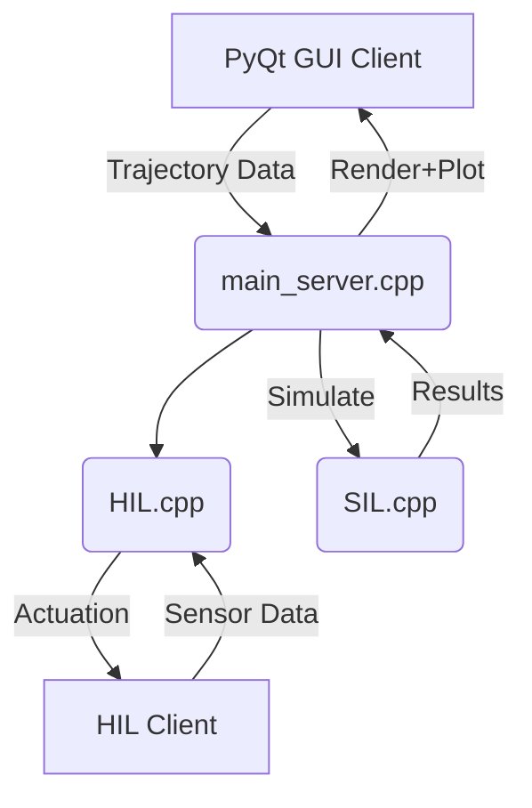

# 🦾 SCARA Robot Simulation & Control Suite

  
**Advanced real-time simulation and control platform for 3-DOF SCARA-like parallel robots**

[](https://www.python.org/)
[](https://opensource.org/licenses/MIT)
[](https://github.com/yourusername/scara-robot/releases)

---

## 🌟 Key Features

- ✅ **3D Real-Time Visualization** (PyVista + PyQt5)
- ✅ **Analytical Inverse Kinematics & Workspace Analysis**
- ✅ **Symbolic Dynamics via EPM (Equivalent Point Mass)**
- ✅ **SIL/HIL Dual Simulation Architecture**
- ✅ **Inverse Dynamics and Torque MPC Controller**
- ✅ **Trajectory Profiling + Velocity/Acceleration Control**
- ✅ **Cross-platform: Windows / Linux / macOS**
- ✅ **Data Logging, Buffering, and Trajectory Replay**

---

## 🚀 Quick Start

### 🔁 One-Line Setup

#### 🪟 Windows:
```bash
launcher.bat
```

#### 🐧 Linux/macOS:
```bash
chmod +x launcher.bash
./launcher.bash
```

This will:
- Set up Python virtual environment
- Install dependencies
- Build the C++ backend
- Launch the GUI

[

---

## 💻 GUI Features


| Feature                     | Description                                                  |
|----------------------------|--------------------------------------------------------------|
| 🛰 3D Scene Viewer          | Real-time render using PyVista and QtInteractor              |
| 🎯 Target Setter            | Precision pose input (±0.1°/mm)                              |
| 🎞 Trajectory Animation     | Time-interpolated motion preview                            |
| ⚙️ Torque Solver            | MPC + inverse dynamics with full robot model                |
| 📊 Plotting Panel           | Velocity, acceleration, and torque visualization            |
| 🧠 Workspace Mapper         | Computes reachable volume and displays spherical workspace  |
| 💾 Data Logging             | CSV export + replay for recorded trajectories               |

---

## 🧠 Architecture Overview

The project uses a **modular client-server design** for simulation and control:



> ✅ Supports both **Software-in-the-Loop (SIL)** and **Hardware-in-the-Loop (HIL)** execution.

---

## 🧮 Core Algorithms

### ⚙️ Dynamics

The system uses a **Lagrangian model with Equivalent Point Mass (EPM)** for distal links, enabling:

- ✔️ Simplified mass distribution without angular velocity terms
- ✔️ Real-time computation of task-to-joint dynamics
- ✔️ Feedforward inverse dynamics via:
  $$
  \tau = M  \ddot{\theta} + G
  $$

See [`docs/kindyn.md`](./docs/kindyn.md) for theory.

---

### 🧾 Control Pipeline

- ✅ **Quintic trajectory interpolation** (C² smoothness)
- ✅ **PID + Feedforward torque control**
- ✅ **MPC-based acceleration inverse dynamics**
- ✅ **Adaptive RK4 with Bogacki-Shampine integration (SIL)**
- ✅ **Real-time 1kHz controller loop (HIL)**

For details, refer to [`docs/control.md`](./docs/control.md)

---

## 📂 Project Layout

<details>
<summary>Click to expand file tree</summary>

```bash
📦 root/
├── assets/               # Icons & media
│   ├── scara_icon.ico/png
│   └── images/           # GIFs, SVGs
├── backend/              # C++ core (dynamics, control)
│   ├── build/            # CMake output
│   ├── include/          # C++ headers (RobotModel, Controller, etc.)
│   ├── src/              # C++ source (SIL.cpp, HIL.cpp, etc.)
│   └── CMakeLists.txt
├── bin/                  # Compiled binaries
├── buffer/               # Trajectory buffer (temp)
│   └── buffer.csv
├── configs/              # Initial and runtime configurations
├── data/                 # Experiment outputs
│   └── Experiment_X/
│       ├── metadata.json
│       └── Trajectory_1.csv
├── docs/                 # Theory and design notes
│   ├── control.md
│   └── kindyn.md
├── robot/                # Python GUI & logic
├── tests/                # Unit, integration, performance tests
├── utils/                # Code generation, symbolic derivation
│   └── generate_params.py
├── SCARA.py              # Python entry point
├── launcher.bat/.bash/.py
├── requirements.txt
└── README.md
```
</details>

---

## 📈 Performance Benchmarks

| Mode     | Timing      | Real-Time Capable | Notes                       |
|----------|-------------|-------------------|-----------------------------|
| SIL      | ~200–500μs  | ❌ No              | Uses adaptive RK4 integration |
| HIL      | ~950μs      | ✅ Yes             | Fixed-step 1kHz loop          |

---

## 🧪 Testing

Run unit + integration tests with:
```bash
pytest tests/
```

Includes:
- 🧠 `robot/kinematics.py`: IK + FK coverage
- 🚀 `backend/RobotModel.cpp`: Dynamics validation
- 📊 `performance/`: GUI + dynamics timing

---

## 📚 References

- Zhou Z., Gosselin C. (2024)  
  *Simplified Inverse Dynamic Models of Parallel Robots Based on Lagrangian Approach*,  
  **Meccanica**, 59:657–680  
  [DOI: 10.1007/s11012-024-01782-6](https://doi.org/10.1007/s11012-024-01782-6)

- Schreiber & Gosselin (2019)  
  *Schönflies Motion PARAllel Robot (SPARA)*, IEEE/ASME Trans. on Mechatronics  
  [DOI: 10.1109/TMECH.2019.2929646](https://doi.org/10.1109/TMECH.2019.2929646)

---

## ✅ Status

| Module       | State         | Notes                                 |
|--------------|---------------|---------------------------------------|
| GUI          | ✅ Stable      | PyQt5 + PyVista                      |
| SIL          | ✅ Operational | Adaptive dynamics simulation          |
| HIL          | ✅ Operational | Real-time control with fixed-rate     |
| IK/FK        | ✅ Validated   | Fully analytical with error handling  |
| Dynamics     | ✅ Verified    | Lagrangian EPM model                  |
| Logging      | ✅ Complete    | Replay and export ready               |


---

## 📄 License

This project is licensed under the MIT License – see the [LICENSE](./LICENSE) file for details.