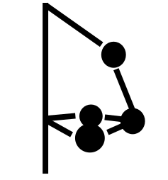

# 🦾 SCARA Robot Simulation & Control GUI
  
*Advanced simulation and control platform for SCARA-type robots*

## 🌟 Features
- **3D Visualization** - PyVista-based real-time kinematic visualization
- **Dynamic Modeling** - Joint torque calculations and motor dynamics
- **Workspace Analysis** - Reachability analysis and collision detection
- **Trajectory Planning** - Angular velocity/acceleration profiling
- **Data Logging** - CSV export/import for trajectory analysis
- **Cross-platform** - Windows/Linux/macOS support

## Setup

#### Launcher :

### Automatic Setup (Recommended)
**Windows**:

>`launcher.bat`
   
**Linux/macOS**:

>`chmod +x launcher.sh`
>
>`./launcher.sh`

The launcher will:

- Verify Python 3.8+ installation
- Install required dependencies automatically
- Launch the application

**Manual Setup**

*For advanced users*:

>`pip install -r requirements.txt`
>
## Running the program

**Standard Launch**

Use the launcher script for best experience:

**Windows**: Double-click launcher.bat

**Linux/macOS**: Execute ./launcher.sh

**Developer Mode**

For direct execution:

>`python SCARA.py`

## GUI

The features include :
> 1. [x] Visualizing current geometry with the PyVista Render
> 2. [x] Choosing target angles with 0.1 deg precision
> 3. [x] Animating the trajectory
> 4. [x] Computing joint torques for trajectory control
> 5. [x] Computing the Workspace accurately
> 6. [x] UX friendly GUI
> 7. [x] Exporting data as a csv file for analysis

Upcoming features :

> 2. [ ] Running a simulink PID stable controller
> 3. [ ] Starting/Stopping data acquisition
> 4. [ ] Having a real-time plot of measured vs shown trajectory

---
#### Elbow position change:

#### Target position change :

#### Plot of motors kinemetics/dynamics :

#### Plot of Workspace / Spherical workspace :

#### Measure and Buffering :

#### Save trajectories :

#### Replay saved trajectories :

## Key Functionalities

### Robot Control

- Real-time joint angle adjustment (0.1° precision)
- Elbow position configuration
- Velocity/acceleration constraints setup

### Visualization Tools

- 3D workspace rendering
- Trajectory animation
- Dynamic solution pathways (A/B configurations)

### Analysis Features

- Motor torque calculations
- Velocity/acceleration profiling
- Inverse dynamics computations

### Data Management

- Trajectory logging/replay
- CSV export/import
- Experiment metadata management

## Project structure

> - **./assets/**
>   - *scara_icon.ico* &rarr; Windows Desktop icon
>   - *scara_icon.png* &rarr; Linux/MacOS Desktop icon
>   - **./images/**
>     - *plot_icon.svg*
>     - *scara_icon.svg*
>     - *{Title}.gif* &rarr; README gifs
> - **./bin/** &rarr; Simulink Control
> - **./buffer/**
>   - *buffer.csv* &rarr; Trajectory buffered before save (t, θ, φ)
> - **./configs/**
>   - *initial.json* &rarr; Geometrical configuration on launch 
>   - *temp.json* &rarr; Current Geometrical configuration 
> - **./data/** &rarr; Trajectory saving directory
>   - **/Experiment_1/** &rarr; Experiment directory
>     - *metadata.json* &rarr; Config file loaded when Experiment directory created
>     - *Trajectory_1.csv* &rarr; Trajectories (t, θ, φ)
>     - *Trajectory_2.csv*
>     - ...
>   - **/Experiment_2/**
>     - *metadata.json*
>     - *Trajectory_1.csv*
>     - *Trajectory_2.csv*
>     - ...
> - **./robot/**
>   - *\_\_init__.py*
>   - *analytic.py* &rarr; Dynamic modeling
>   - *gui.py* &rarr; **PyQt** Main window 
>   - *kinematics.py* &rarr; Inverse Kinematics (IK)
>   - *misc.py* &rarr; Miscallenous functions
>   - *scene.py* &rarr; **PyVista** QtInteractor widget
> - **./tests/**
>   - **./integration/** &rarr; Checks **PyQt** creation
>     - *integration_test.py*
>   - **./performance/** &rarr; Checks performance
>     - *dynamics_perf_test.py*
>     - *gui_perf_test.py*
>     - *kinematics_perf_test.py*
>     - *memory_perf_test.py*
>   - **./unit/** &rarr; Checks main functions
>     - *config_test_test.py*
>     - *conftest.py*
>     - *dynamics_test.py*
>     - *kinematics_test.py*
>     - *velocity_profile_test.py*
> - **./docs/**
>   - [*control.md*](./docs/control.md) / [*kindyn.html*](./docs/kindyn.html) &rarr; Theory / choices for robot control
>   - [*kindyn.md*](./docs/kindyn.md) / [*kindyn.html*](./docs/kindyn.html) &rarr; Theory / choices for kinematic/dynamic modeling
> - .*gitignore*
> - *launcher.bash* &rarr; Windows Launcher executable
> - *launcher.bat* &rarr; Linux/MacOS Launcher Executable
> - *launcher.py* &rarr; Launcher script
> - *LICENSE*
> - *README.md / README.html*
> - *requirements.txt*
> - *SCARA.py* &rarr; Application Entry point

## Control

The simulink *C++* export binary is located inside ***./bin/***, for additional details you can read more in [***./docs/control.md***](./docs/control.md) 