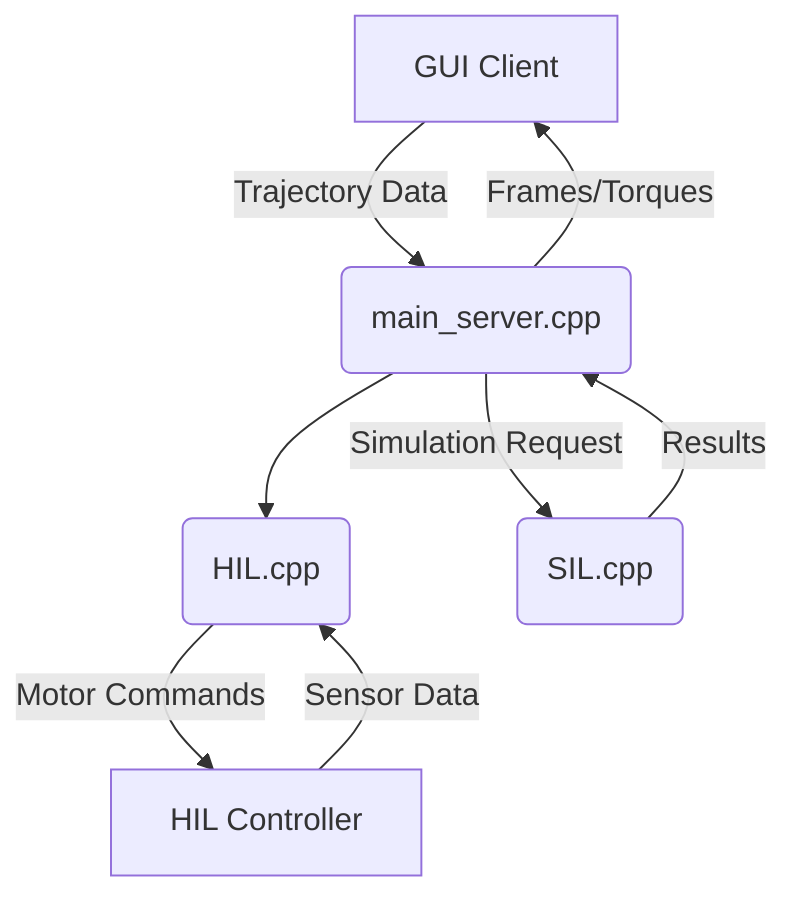

# Control Architecture for SCARA Robot Simulation

## Overview

The control system supports both Software-in-the-Loop (SIL) and Hardware-in-the-Loop (HIL) simulations with a client-server architecture:

***SIL*:** Pure software simulation for algorithm validation

***HIL*:** Real-time control with physical hardware interface

***Server*:** Handles trajectory processing and simulation

***Clients*:** GUI for visualization and embedded controller for HIL



## Server Architecture (main_server.cpp)
### Key Features:
 **TCP/IP Communication:** Listens on port 5555 for client connections

**Chunked Data Transfer:** Handles large trajectories in manageable chunks

**Cross-platform:** Supports Windows (Winsock) and Linux/macOS (POSIX sockets)

**Parallel Processing:** Spawns separate threads for each client

**Data Flow:** 

- Receives trajectory waypoints + elbow configuration

- Validates trajectory size (prevents memory overflows)

- Passes data to SIL simulation engine

- Streams results back to client in binary format:

- Simulation frames (position, velocity, torque)

- Ideal torque points (for analysis)

**Optimization:**

```cpp
constexpr size_t MAX_SOCKET_CHUNK = 10 * 1024 * 1024;  // 10MB chunks
constexpr size_t FRAME_CHUNK_SIZE = 500;  // Balance
```


## SIL Simulation Pipeline (SIL.cpp)

### Simulation Stages:

**Ideal Torque Precomputation:**

- Solves inverse kinematics for each waypoint

- Calculates inverse dynamics for ideal torque values

**Adaptive RK4 Integration:**

- Uses error-controlled step sizing (Bogacki-Shampine method)

- Implements anti-windup for integral terms

- Handles singularities with damped pseudoinverse

```cpp
// Adaptive stepping parameters

double dt = 0.001;
double dt_min = 1e-6;
double dt_max = 1e-2;
double error_tol = 1e-3;</code>
```

**Real-time Constraints:**

```cpp
 // Chunking

constexpr size_t MAX_FRAME_POINTS = 1000000;  // Memory safety
if (results_out.size() >= MAX_FRAME_POINTS) break;</code>
```

## HIL Controller (HIL.cpp)

### Embedded-Friendly Design:
**Sensor Processing:**

- Spherical coordinate input (r, θ, φ)

- Low-pass filters for noise reduction

- Finite-difference velocity estimation

**Real-time Loop:**

- Fixed-frequency execution (1kHz typical)

- Timing precision with std::chrono

- Overrun detection and logging

```cpp
// Timing control example

auto loop_start = std::chrono::steady_clock::now();
// ... control calculations ...
auto loop_end = std::chrono::steady_clock::now();
auto elapsed = ...;
long sleep_us = static_cast<long>(dt * 1e6) - elapsed.count();
if (sleep_us > 0) std::this_thread::sleep_for(...);
```

**Fault Tolerance:**

- IK fallback to previous valid solution

- Torque limiting (±torque_limit)

- NaN detection in control outputs

**Hardware Abstraction:**
```cpp
class HardwareInterface {

 public:
    virtual SensorReading getSensorData() = 0;
    virtual void sendMotorTorques(const Eigen::Vector3d& torques)= 0;
>};
```

## Dynamics & Control Core
### Robot Model (RobotModel.cpp)

**Kinematics:**

- Analytical IK with configuration continuity

- Forward kinematics via geometric constraints

- Singularity-robust Jacobians

**Dynamics:**

- Recursive Newton-Euler formulation

- Mass matrix with distributed inertia

- Gravity compensation with payload

### Controller (Controller.cpp)

**Trajectory Interpolation:**

- Quintic Hermite splines for smooth motion

- C² continuous position/velocity/acceleration

**MPC Torque Computation:**

```cpp
Eigen::Vector3d Controller::computeMPCTorque(...) {
  // PID error terms with anti-windup
  integral_error += error_pos * dt;
  integral_error = integral_error.cwiseMax(-integral_max).cwiseMin(integral_max);
  
  // Task-space to joint-space conversion
  Eigen::Matrix3d K_inv = robot.dampedPseudoInverse(K);
  Eigen::Vector3d theta_ddot_desired = K_inv * (...);
  
  // Dynamics compensation
  Eigen::Vector3d tau = M * theta_ddot_desired + G;
  return tau.cwiseMax(-torque_limit).cwiseMin(torque_limit);
}
```

**Performance Optimizations**
- Eigen Templates: Fixed-size matrices for stack allocation

- Trajectory Caching: Precomputed ideal torques

- Batch Processing: Matrix operations instead of element-wise

- Algebraic Simplification: Precomputed EoM terms

- Memory Management: Reserved vectors with estimated capacity

**Loop Control Strategies**


| System   | Control | Method    | Frequency | Real-time |
| -------- | ------- | -------- | ------- | ------- |
| *SIL*  | Feedforward PID    | Adaptive RK4  | Variable| No   |
| *HIL* |  Feedforward PID    | Fixed-step MPC | 1kHz fixed | Yes|


**Key Metrics:**

*SIL*: 100-500μs per simulation step (depending on complexity)

*HIL*: <1ms total cycle time (sensor→computation→actuation)

**Embedded Design Choices**

- No Dynamic Allocation: Fixed-size arrays for critical paths

- FPU-Friendly: Single-precision floats where possible

- Sensor Filtering: Low-pass with O(1) complexity

- Hardware Abstraction: Portable interface layer

- Fault Recovery: Fallback to last valid state

- Efficient Trig: atan2 instead of manual quadrant checks

```cpp
// Embedded-friendly low-pass filter
class LowPassFilter {
public:
    double filter(double new_value) {
        value_ = alpha_ * new_value + (1 - alpha_) * value_;
        return value_;
    }
};
```

## Conclusion
This architecture provides:

- High-fidelity simulation for development (SIL)

- Deterministic real-time control (HIL)

- Cross-platform compatibility

- Memory-safe operation

- Embedded-ready implementation

The separation between simulation core and hardware interface enables seamless transition from virtual prototyping to physical deployment.