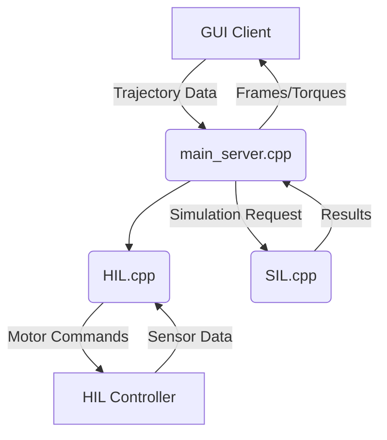

# Control Architecture for SCARA Robot Simulation

## Overview

The control system supports both Software-in-the-Loop (SIL) and Hardware-in-the-Loop (HIL) simulations with a client-server architecture:

***SIL*:** Pure software simulation for algorithm validation

***HIL*:** Real-time control with physical hardware interface

***Server*:** Handles trajectory processing and simulation

***Clients*:** GUI for visualization and embedded controller for HIL


```mermaid
graph TD;
    A[GUI Client] -->|Trajectory Data| B(main_server.cpp);
    C[HIL Controller] -->|Sensor Data| D(HIL.cpp);
    B -->D;
    B -->|Simulation Request| E(SIL.cpp);
    E -->|Results| B;
    B -->|Frames/Torques| A;
    D -->|Motor Commands| C;
```

## Server Architecture (main_server.cpp)
### Key Features:
 **TCP/IP Communication:** Listens on port 5555 for client connections

**Chunked Data Transfer:** Handles large trajectories in manageable chunks

**Cross-platform:** Supports Windows (Winsock) and Linux/macOS (POSIX sockets)

**Parallel Processing:** Spawns separate threads for each client

**Data Flow:** 

- Receives trajectory waypoints + elbow configuration

- Validates trajectory size (prevents memory overflows)

- Passes data to SIL simulation engine

- Streams results back to client in binary format:

- Simulation frames (position, velocity, torque)

- Ideal torque points (for analysis)

**Handshake – first byte tells us SIL or HIL; if mode 'H' two optional length‑prefixed strings follow (sensor device, Arduino device; defaults: `/dev/ttyUSB0`, auto‑detect)** 

### Implementation Overview
```
main() ──> accept() loop ──> thread(handle_client)
```

*Server startup*
```cpp
socket_t server_fd = socket(AF_INET, SOCK_STREAM, 0);       // POSIX / Winsock wrapper
setsockopt(server_fd, SOL_SOCKET, SO_REUSEADDR, ...);       // fast restart
bind(server_fd, "0.0.0.0:5555");                            // PORT macro
listen(server_fd, 10);                                      // backlog
```

*Per‑client worker (`handle_client`)*  
1. Parse mode byte (`'S'` for SIL, `'H'` for HIL).  
2. In HIL, read two device strings *(len, bytes)*.  
3. Read `int32 nWaypoints` + elbow `(ex,ey,ez)` + `l_arm` (double ×4).  
4. Receive way‑points in ≤1000‑pt blocks until vector filled (max 1 M). 
5. Dispatch to `run_sil_streaming` **or** `run_hil_streaming`.  
6. In HIL, send 16‑byte header (`double endTime`, `int32 nWp`) before frame stream so GUI can pre‑allocate.   
7. Half‑close socket (SHUT_WR / SD_SEND) to signal EOF, then let thread exit.  

The accept loop detaches each worker thread, enabling parallel client sessions. For more details on the protocol see [`docs/binary_protocol.md`](./binary_protocol.md)


## SIL Simulation Pipeline (SIL.cpp)

### Simulation Stages:

**Ideal Torque Precomputation:**

- Solves inverse kinematics for each waypoint

- Calculates inverse dynamics for ideal torque values

**Adaptive RK4 Integration:**
> **KalmanFilter3D** — constant‑velocity EKF run every 1 ms to denoise $\dot x$ before torque computation


- Uses error-controlled step sizing (Bogacki-Shampine method)

- Implements anti-windup for integral terms

- Handles singularities with damped pseudoinverse

```cpp
// Adaptive stepping parameters (Bogacki‑Shampine)

double dt      = 1e-6;
double dt_min  = 1e-8;
double dt_max  = 5e-5;
```

**Real-time Constraints:**

```cpp
 // Chunking

constexpr size_t MAX_FRAME_POINTS = 1000000;  // Memory safety
if (results_out.size() >= MAX_FRAME_POINTS) break;</code>
```

## HIL Controller (HIL.cpp)

### Embedded-Friendly Design:

**Sensor Processing:**

 - Spherical coordinate input (r, θ, φ)

 - **6‑state KalmanPosVel** filter for position & velocity; lock‑step with 1 kHz loop

**Real-time Loop:**

- Fixed‑frequency execution (1 kHz typical)

- Online **range‑bias RLS estimator** keeps rod‑length quasi constant

- Timing precision with std::chrono

- Overrun detection and logging

### Trajectory Ring Buffer
The HIL module maintains a **2 000‑sample ring buffer** of incoming way‑points (`TrajectoryRingBuffer`).  Samples are linearly interpolated on demand.  

Expected CSV format:

`P,t,x,y,z,xd,yd,zd,xdd,ydd,zdd`

The host can stream additional segments in real‑time when the buffer runs low.


```cpp
// Timing control example

auto loop_start = std::chrono::steady_clock::now();
// ... control calculations ...
auto loop_end = std::chrono::steady_clock::now();
auto elapsed = ...;
long sleep_us = static_cast<long>(dt * 1e6) - elapsed.count();
if (sleep_us > 0) std::this_thread::sleep_for(...);
```

**Fault Tolerance:**

- IK fallback to previous valid solution

- Torque limiting (±torque_limit)

- NaN detection in control outputs

**Hardware Abstraction:**
```cpp
class HardwareInterface {

 public:
    virtual SensorReading getSensorData() = 0;
    virtual void sendMotorTorques(const Eigen::Vector3d& torques)= 0;
>};
```

## Dynamics & Control Core
### Robot Model (RobotModel.cpp)

**Kinematics:**

- Analytical IK with configuration continuity

- Forward kinematics via geometric constraints

- Singularity-robust Jacobians

**Dynamics:**

- Recursive Newton-Euler formulation

- Mass matrix with distributed inertia

- Gravity compensation with payload

### Controller (Controller.cpp)

**Trajectory Interpolation:**

- Quintic Hermite splines for smooth motion

- C² continuous position/velocity/acceleration

**MPC Torque Computation:**

```cpp
Eigen::Vector3d Controller::computeMPCTorque(...) {
  // PID error terms with anti-windup
  integral_error += error_pos * dt;
  integral_error = integral_error.cwiseMax(-integral_max).cwiseMin(integral_max);
  
  // Task-space to joint-space conversion
  Eigen::Matrix3d K_inv = robot.dampedPseudoInverse(K);
  Eigen::Vector3d theta_ddot_desired = K_inv * (...);
  
  // Dynamics compensation
  Eigen::Vector3d tau = M * theta_ddot_desired + G;
  return tau.cwiseMax(-torque_limit).cwiseMin(torque_limit);
}
```

**Performance Optimizations**
- Eigen Templates: Fixed-size matrices for stack allocation

- Trajectory Caching: Precomputed ideal torques

- Batch Processing: Matrix operations instead of element-wise

- Algebraic Simplification: Precomputed EoM terms

- Memory Management: Reserved vectors with estimated capacity

**Loop Control Strategies**


| System   | Control | Method    | Frequency | Real-time |
| -------- | ------- | -------- | ------- | ------- |
| *SIL*  | Feedforward PID    | Adaptive RK4  | Variable| No   |
| *HIL* |  Feedforward PID    | Fixed-step MPC | 1kHz fixed | Yes|


**Key Metrics:**

*SIL*: 100-500μs per simulation step (depending on complexity)

*HIL*: <1ms total cycle time (sensor→computation→actuation)

**Embedded Design Choices**

- No Dynamic Allocation: Fixed-size arrays for critical paths

- FPU-Friendly: Single-precision floats where possible

- Sensor Filtering: Low-pass with O(1) complexity

- Hardware Abstraction: Portable interface layer

- Fault Recovery: Fallback to last valid state

- Efficient Trig: atan2 instead of manual quadrant checks

```cpp
// Embedded-friendly low-pass filter
class LowPassFilter {
public:
    double filter(double new_value) {
        value_ = alpha_ * new_value + (1 - alpha_) * value_;
        return value_;
    }
};
```

## Conclusion
This architecture provides:

- High-fidelity simulation for development (SIL)

- Deterministic real-time control (HIL)

- Cross-platform compatibility

- Memory-safe operation

- Embedded-ready implementation

The separation between simulation core and hardware interface enables seamless transition from virtual prototyping to physical deployment.